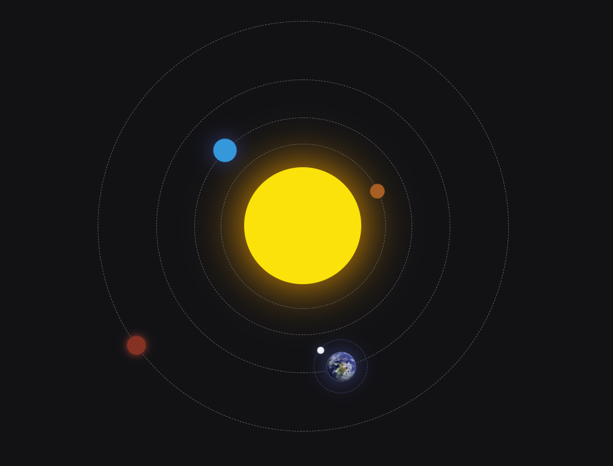

# Front end samples

This is a front end sample repository using only HTML CSS and JS code.

It will be enriched as it goes with more funy code sample.

Right now it contains : 

- Solar-system-1 : A simple solar system using HTML CSS only. Using mainly position relative and absolute, border radius, animation like rotate, and color to achieve it.

Here is the result unanimated off course : 

